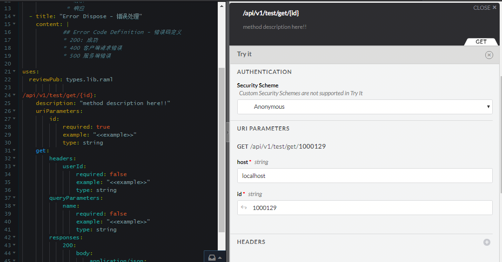

# Spring MVC translates into RAML specification maven plugin
Most of the current RAML tools translate previously defined RAML files into spring server side code, but most existing projects do not fully comply with the Restful API specification,
So you need to convert existing Spring MVC project to RAML specification, need tools have a certain flexibility,
generate only RAML based definition file including scanning @ Controller/RestController comments generated API resource definition,
scan the Java pojo class to generate the RAML type definition.
The two documents are reorganized by the developer,reducing the amount of effort required to manually write RAML specifications from scratch
 
[](README_zh.md)
## Plugin instructions
### local install maven plugin
* git clone https://github.com/iamhuzl/java2raml.git
* mvn install

### configuration maven plugin
 configuration maven pom
```xml
<build>
        <plugins>
            <plugin>
                <groupId>cn.herofrog.maven.plugin</groupId>
                <artifactId>rest2raml-maven-plugin</artifactId>
                <version>1.0-SNAPSHOT</version>
                <executions>
                    <execution>
                        <phase>compile</phase>
                        <goals>
                            <goal>pojo2raml</goal>
                        </goals>
                    </execution>
                </executions>
                <configuration>
                    <targetClass>cn.herofrog.maven.plugin.example.data.WebResponse</targetClass>
                    <targetPackage>cn.herofrog.maven.plugin.example.data</targetPackage>
                </configuration>
            </plugin>
            <plugin>
                <groupId>cn.herofrog.maven.plugin</groupId>
                <artifactId>rest2raml-maven-plugin</artifactId>
                <version>1.0-SNAPSHOT</version>
                <executions>
                    <execution>
                        <phase>compile</phase>
                        <goals>
                            <goal>controller2raml</goal>
                        </goals>
                    </execution>
                </executions>
                <configuration>
                    <basePackages>cn.herofrog.maven.plugin.example.web</basePackages>
                </configuration>
            </plugin>
        </plugins>

    </build>
```
### pojo2raml maven mojo
Convert the Java Pojo class into a raml library file
* targetClass Specify a specific class name
* targetPackage Pojo package name
### controller2raml maven mojo
Scan all Spring Controller classes under the package name to generate raml files
* basePackages Package names containing Controller are separated by commas if multiple

### Generate the raml file
* execute command mvn package  
Two files are generated in the target directory
    - project-api-definition.yaml restful api resource raml file
    - project-api-types.yaml Java Pojo class raml library file 

Based on these two files, write the new raml file and import the types definition using the raml USES directive

### example
```yaml
#%RAML 1.0
title: Project Spring Restful Api Definition
baseUri: "http://{host}:8080"
version: 1.0
             
uses:
  reviewPub: types.lib.raml   
documentation: 
  - title: "API Base Rule - 基本规范"
    content: |
            ##API基本规范介绍1
             * 请求
             * 响应
  - title: "Error Dispose - 错误处理"
    content: |
            ## Error Code Definition - 错误码定义
            * 200: 成功 
            * 400 客户端请求错误 
            * 500 服务端错误
             
uses:
  reviewPub: types.lib.raml
              
/api/v1/test/get/{id}: 
    description: "method description here!!"
    uriParameters: 
        id: 
            required: true
            example: "<<example>>"
            type: string
    get: 
        headers: 
            userId: 
                required: false
                example: "<<example>>"
                type: string
        queryParameters: 
            name: 
                required: false
                example: "<<example>>"
                type: string
        responses: 
            200: 
                body: 
                    application/json: 
                        type: reviewPub.WebRequest

```
 ## Use introduction of the raml tool API -designer
 * npm install -g api-designer
 * Direct execution api-designer
 * Open browser and access http://localhost:3000/



## Next step
- [ ] Generate response example
- [ ]  supports Java Pojo custom wrap
- [ ] Analyze the comment in the Java source and convert them to field description


