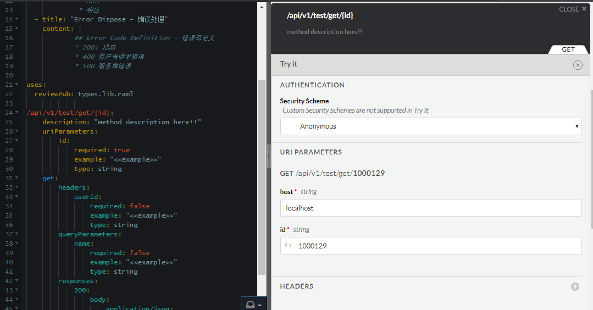

# Spring MVC 转换为RAML规范maven plugin
目前大部分RAML的工具都是把之前定义好的raml文件转成spring server端代码，但大多数已经存在的项目并不是完全符合Restful API规范，
所以需要把已有的Spring MVC项目转成raml规范，需要工具具备一定的灵活性，只生成raml基本规范包括扫描@Controller/RestController注解生成
主要api resource的声明，并可扫描Java pojo类生成raml type生成，由开发人员根据这两份文档重新整理，降低手工从头编写raml规范的工作量

## 插件说明
### 本地打包安装maven plugin
* git clone https://github.com/iamhuzl/java2raml.git
* mvn install

### 配置maven plugin
 配置pom
```xml
<build>
        <plugins>
            <plugin>
                <groupId>cn.herofrog.maven.plugin</groupId>
                <artifactId>rest2raml-maven-plugin</artifactId>
                <version>1.0-SNAPSHOT</version>
                <executions>
                    <execution>
                        <phase>compile</phase>
                        <goals>
                            <goal>pojo2raml</goal>
                        </goals>
                    </execution>
                </executions>
                <configuration>
                    <targetClass>cn.herofrog.maven.plugin.example.data.WebResponse</targetClass>
                    <targetPackage>cn.herofrog.maven.plugin.example.data</targetPackage>
                </configuration>
            </plugin>
            <plugin>
                <groupId>cn.herofrog.maven.plugin</groupId>
                <artifactId>rest2raml-maven-plugin</artifactId>
                <version>1.0-SNAPSHOT</version>
                <executions>
                    <execution>
                        <phase>compile</phase>
                        <goals>
                            <goal>controller2raml</goal>
                        </goals>
                    </execution>
                </executions>
                <configuration>
                    <basePackages>cn.herofrog.maven.plugin.example.web</basePackages>
                </configuration>
            </plugin>
        </plugins>

    </build>
```
### pojo2raml maven mojo
把Java Pojo类转成raml library文件
* targetClass 指明具体类名
* targetPackage Pojo类包名
### controller2raml maven mojo
扫描包名下所有Spring Controller类生成raml文件
* basePackages 包含Controller的包名，若多个则用逗号分隔

### 生成raml文件
* 执行命令 mvn package
在target目录会生成两个文件
    * project-api-definition.yaml restful api resource raml file
    * project-api-types.yaml Java Pojo class raml library file 

在这两个文件基础上编写新的raml文件，使用raml uses指令导入types定义

### 示例
```yaml
#%RAML 1.0
title: Project Spring Restful Api Definition
baseUri: "http://{host}:8080"
version: 1.0
             
uses:
  reviewPub: types.lib.raml   
documentation: 
  - title: "API Base Rule - 基本规范"
    content: |
            ##API基本规范介绍1
             * 请求
             * 响应
  - title: "Error Dispose - 错误处理"
    content: |
            ## Error Code Definition - 错误码定义
            * 200: 成功 
            * 400 客户端请求错误 
            * 500 服务端错误
             
uses:
  reviewPub: types.lib.raml
              
/api/v1/test/get/{id}: 
    description: "method description here!!"
    uriParameters: 
        id: 
            required: true
            example: "<<example>>"
            type: string
    get: 
        headers: 
            userId: 
                required: false
                example: "<<example>>"
                type: string
        queryParameters: 
            name: 
                required: false
                example: "<<example>>"
                type: string
        responses: 
            200: 
                body: 
                    application/json: 
                        type: reviewPub.WebRequest

```
 ## raml工具 api-designer使用介绍
 * npm install -g api-designer
 * 直接执行命令 api-designer
 * 浏览器访问 http://localhost:3000/



## 下一步计划
- [ ] 生成响应示例
- [ ] Java Pojo支持自定义wrap
- [ ] 分析Java源码中的注释并转为字段说明


